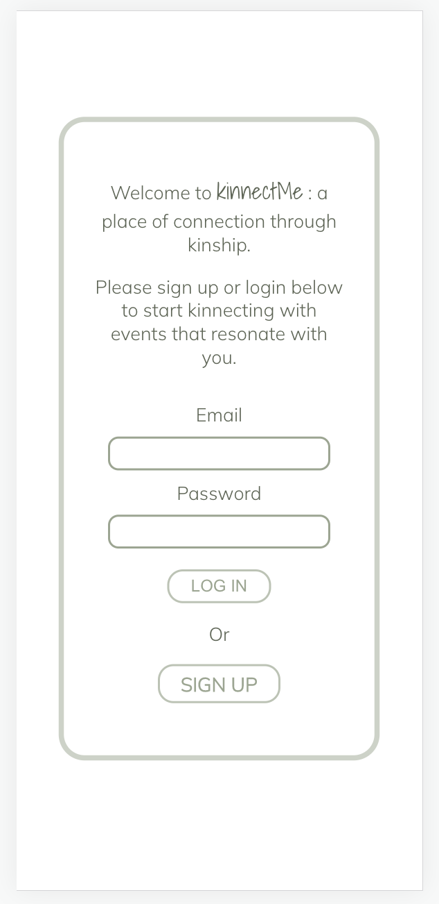
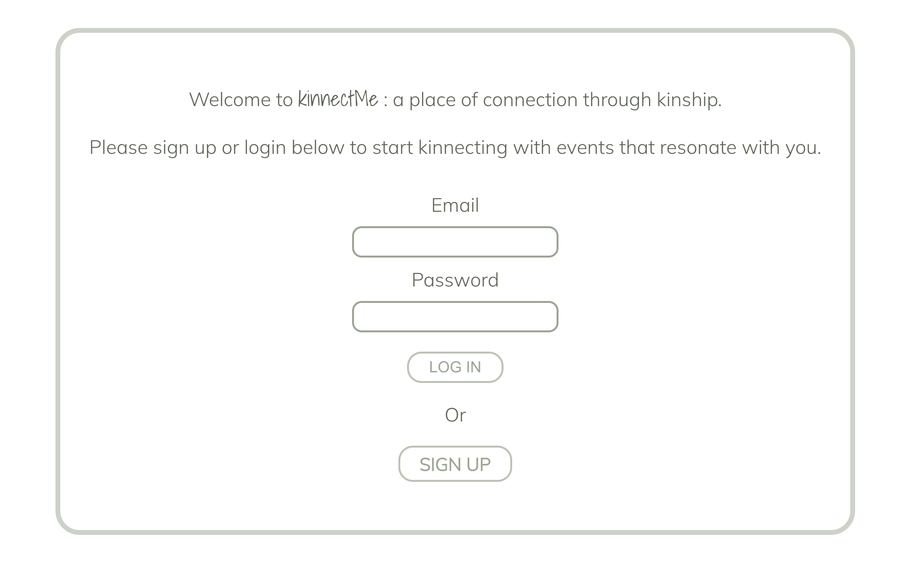
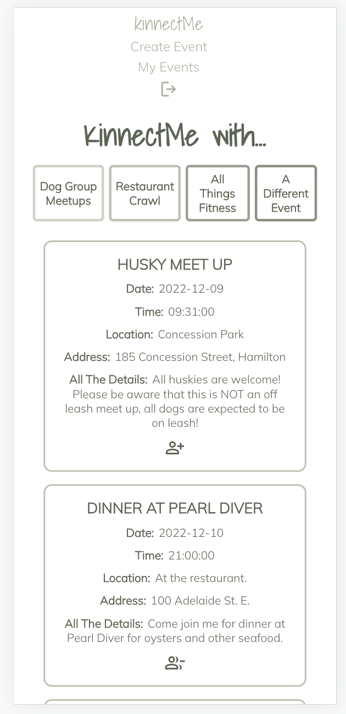
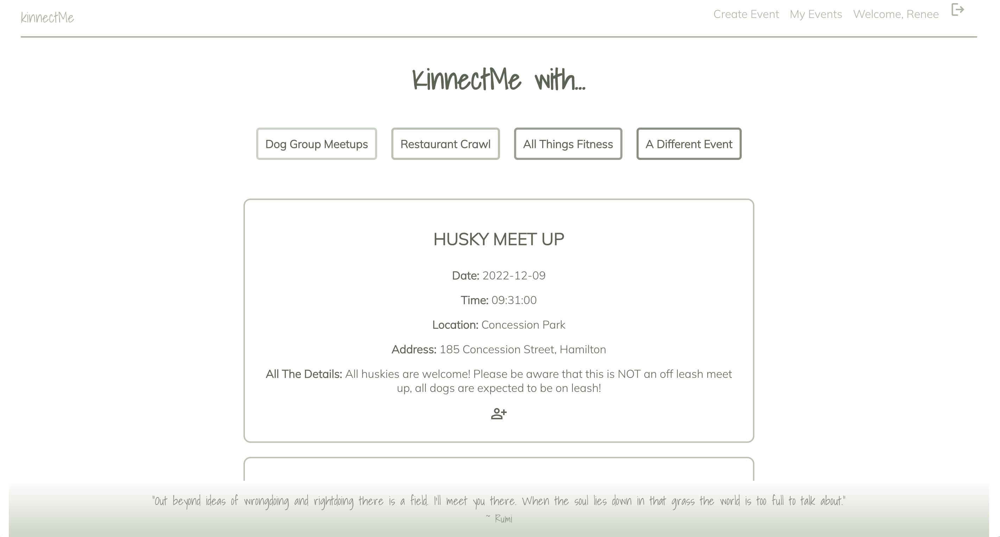
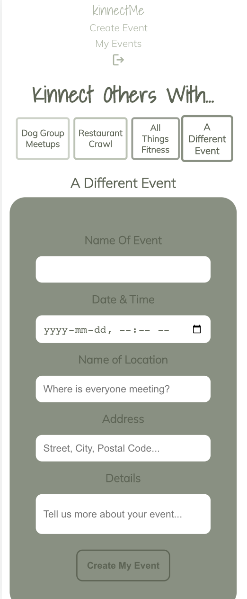
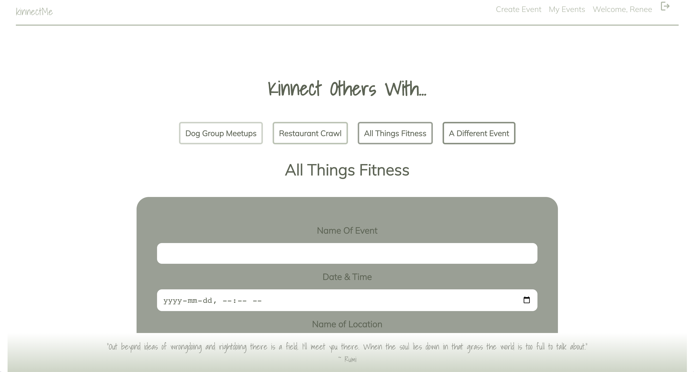
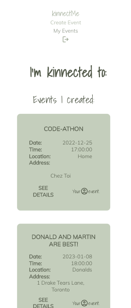
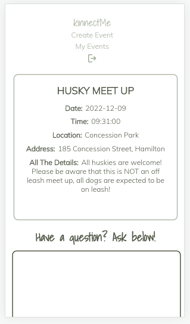
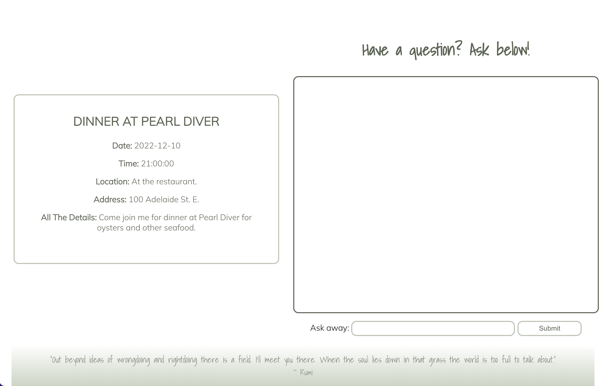
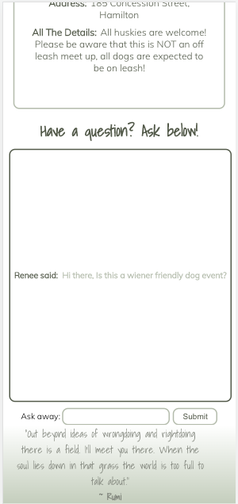

# kinnectMe

kinnectMe, a self-care through social connectivity mobile and web application, is an online directory of user created events, where users can find one another through shared interests.

Once you are signed up and loggin in, you will be able to attended events already created by other users, and create your own events for other users to attend. Users are able to ask questions and get answers through a comment feature.

Let's kinnect.

## Try it out!

[Click Here!](https://kinnectme.herokuapp.com/)

## Authors

- [@amandafroment](https://github.com/amandafroment)
- [@nallicock](https://github.com/nallicock)
- [@rasl76](https://github.com/rasl76)
- [@donaldyang17](https://github.com/donaldyang17)

## Skills Used

<li> MongoDb
<li> Mongoose
<li> Express
<li> React
<li> Node.js
<li> Axios

## Entity Relationship Diagram

## Screenshots

Log-in + Sign up;

Find Events:

Create an event:

My Events:

Event Details Page:

## Demo

Coming soon!!

[Application Demo Video]()

## Future Enhancements (Icebox Items)

AAU, I would like to be able to see comments or a chat for each event in real time
AAU, I want to be able to search for events based on location or the name of the event
AAU, I would like to invite other friends to my event through email or username
Implementing Geocodio to match addresses for our locations/addresses of our events
Implementing Google API for autocomplete for the locations/addresses of our events
Implementing a web socket for the chat feature or comments in real time
Adding to our event/user component to show past events on the MyEvents page

## Other Links

[Trello Board](https://trello.com/b/27LwwkwG/react-group-4#)
