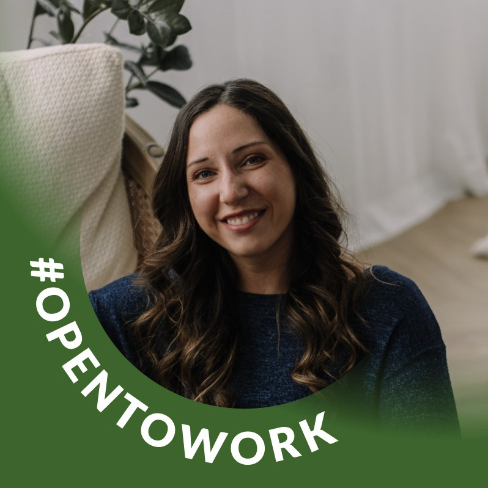
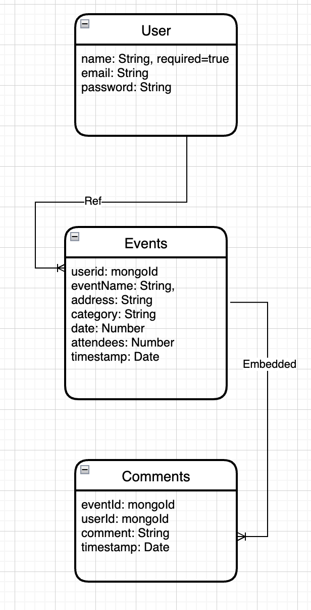

# kinnectMe

kinnectMe, a self-care through social connectivity mobile and web application, is an online directory of user created events, where users can find one another through shared interests.

Once you are signed up and loggin in, you will be able to attended events already created by other users, and create your own events for other users to attend. Users are able to ask questions and get answers through a comment feature.

Let's kinnect.

## Try it out!

[Click Here!](https://kinnectme.herokuapp.com/)

## Authors

- [@amandafroment](https://github.com/amandafroment)
- [@nallicock](https://github.com/nallicock)
- [@rasl76](https://github.com/rasl76)
- [@donaldyang17](https://github.com/donaldyang17)

## Skills Used

<li> MongoDb
<li> Mongoose
<li> Express
<li> React
<li> Node.js
<li> Axios

## Entity Relationship Diagram

## Screenshots

## Demo 

[Entity Relationship Diagram (ERD)](https://app.diagrams.net/#LERD%20for%20project%204)

## Future Enhancements (Icebox Items)

## Other Links

[Trello Board](https://trello.com/b/27LwwkwG/react-group-4#)
