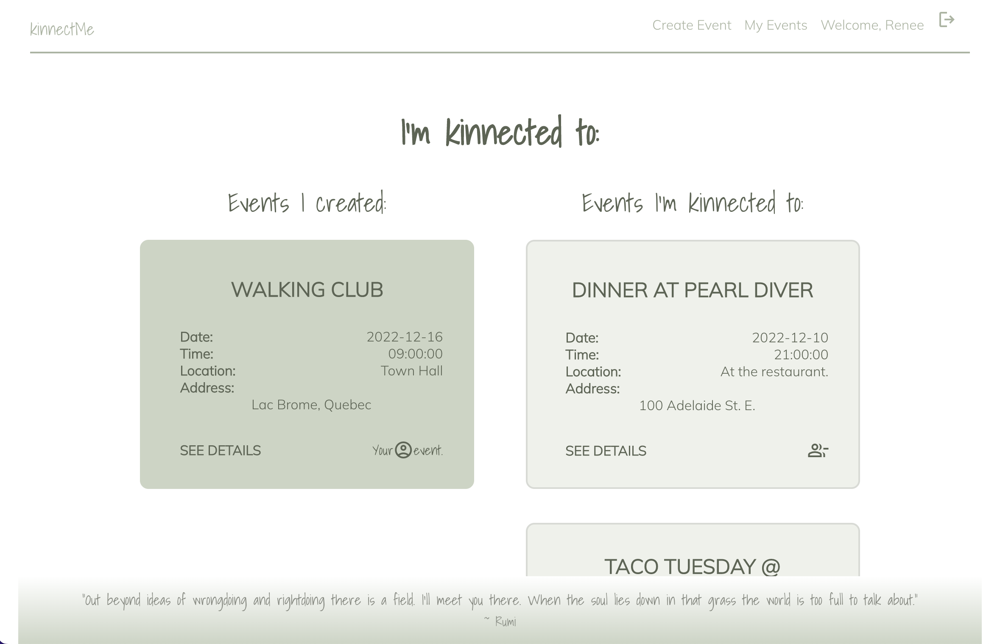

# kinnectMe

kinnectMe is an online directory of user created events, where users can connect with others through shared events. Once a user signs up and logs in to the app, they will be able to attend events that are created by other users in their area, or they can create their own events for other users to attend. Those who want to know more about an event can comment on the event details page to connect with the creator of the event, as well as others who are planning on attending.

The goal when creating kinnectMe was to promote self-care by creating an online environment of social connectivity through shared interests. When you log on to the application, you will be greeted with a calming front-end design, which was purposefully done to match the overall theme and goal of the project. 

## Let's Kinnect!

[Click Here!](https://kinnectme.herokuapp.com/)

## Authors

- [@amandafroment](https://github.com/amandafroment)
- [@nallicock](https://github.com/nallicock)
- [@rasl76](https://github.com/rasl76)
- [@donaldyang17](https://github.com/donaldyang17)

   

## Skills Used

<li> MongoDb
<li> Mongoose
<li> Express
<li> React
<li> Node.js
<li> Axios

## Entity Relationship Diagram

## Screenshots

Log-in + Sign up;
 
 
 
 
 
Find Events
 
 
 
 
 
Create an event:
 
 
 
 
 
 
My Events:
 
 

 
 
 
Event Details Page:
 
 
    
 
 
 

## Demo

Coming soon!!

[Application Demo Video]()

## Future Enhancements (Icebox Items)

<li> AAU, I would like to be able to see comments or a chat for each event in real time
<li> AAU, I want to be able to search for events based on location or the name of the event
<li> AAU, I would like to invite other friends to my event through email or username
<li> Implementing Geocodio to match addresses for our locations/addresses of our events
<li> Implementing Google API for autocomplete for the locations/addresses of our events
<li> Implementing a web socket for the chat feature or comments in real time
<li> Adding to our event/user component to show past events on the MyEvents page
<li> AAU I would like to know who the creator of an event is and be able to see other events they have created I might want to attend.

## Other Links

[Trello Board](https://trello.com/b/27LwwkwG/react-group-4#)

